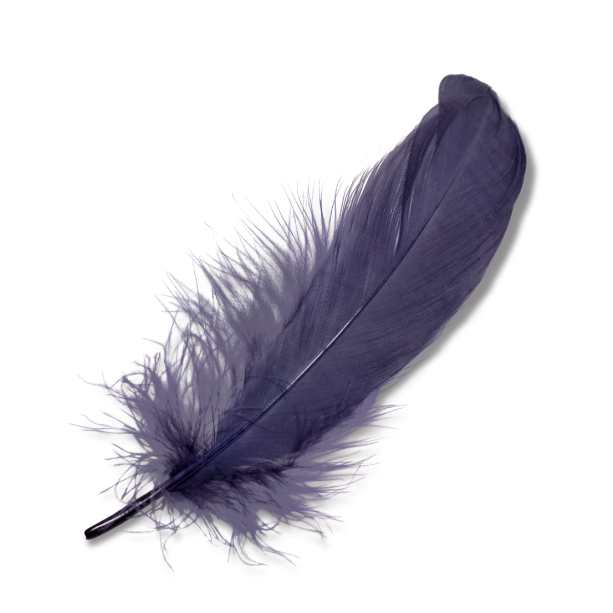
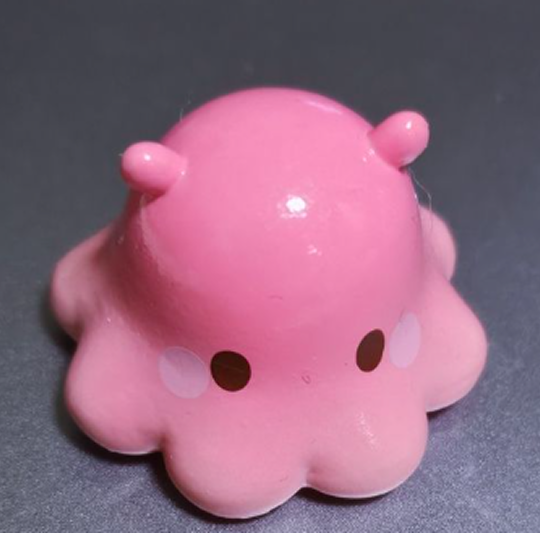
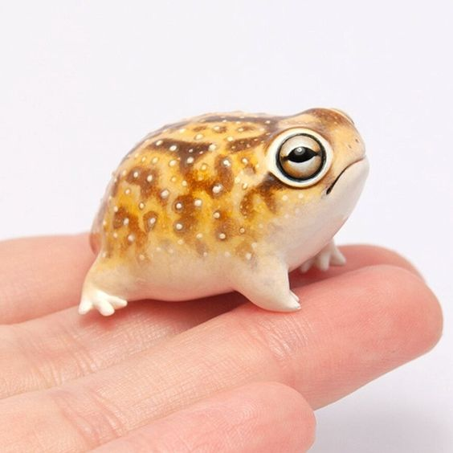
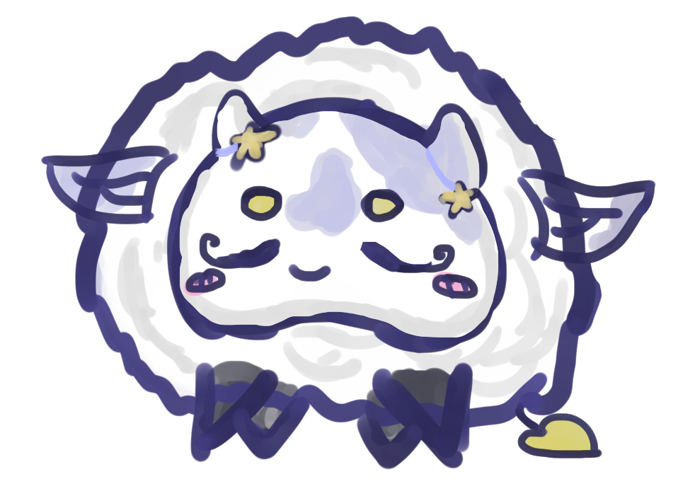

<!DOCTYPE html>
<html lang="ru">
<head>
<meta charset="UTF-8">
<meta name="viewport" content="width=device-width, initial-scale=1.0">
<title>О мастере — HEARTO</title>

<link rel="stylesheet" href="style.css">
<link rel="stylesheet" href="https://cdnjs.cloudflare.com/ajax/libs/font-awesome/6.4.0/css/all.min.css">
<link rel="stylesheet" href="сайт/style/adabtive.css">

</head>

<body>

<!-- перья -->

    

    

    

<!-- ХЕДЕР -->
<header id="header">
    

        
HEARTO

        <button class="burger" id="burgerBtn">☰</button>
        <nav>
            <a href="index.html#portfolio">Работы</a>
            <a href="about.html" style="color:#5B4BFF;">О мастере</a>
            <a href="index.html#process">Процесс</a>
            <a href="delivery.html">Доставка</a>
            <a href="order.html" class="btn">Заказать</a>
        </nav>
    

</header>

<!-- ОСНОВА -->
<section class="about-master">

    <!-- ГИФКА — УМЕРЕННЫЙ РАЗМЕР -->
    

        
    

    <!-- ТЕКСТ -->
    

        
<i class="fas fa-star"></i>

        
<i class="fas fa-moon"></i>

        <h1>Мастерская </h1>

        
<strong>Дорогие посетители</strong>

        

        Вы оказались в небольшой мастерской, которую я открыла совсем недавно.  
        Я только начинаю этот путь, но уже сейчас создаю работы вручную, уделяя внимание форме, деталям и общему ощущению.
        

        

        Пока мастерская только начинает свою историю, каждая работа становится частью этого пути — аккуратного, немного экспериментального и по-своему особенного.
        Я принимаю идеи и эскизы, иногда даже просто образы без точного описания — этого достаточно, чтобы появилась форма.
        

        

        Работы могут немного отличаться, иногда быть неидеальными, но именно это делает их живыми и настоящими.
        

        

        В процессе я соединяю разные материалы и техники, чтобы добиться нужного характера и настроения.
        

        

             Спасибо, что заглянули 
            Здесь всё создаётся вручную
        

        

            <i class="fas fa-feather-alt"></i> Имя пока не публикуется — важнее сами игрушки
        

    

</section>

<!-- ФУТЕР -->
<footer>
    

        

            

                <h3>HEARTO</h3>
                
Авторские игрушки

            

            

                <h4>Навигация</h4>
                <a href="index.html#portfolio">Работы</a>
                <a href="about.html">О мастере</a>
                <a href="index.html#process">Процесс</a>
                <a href="delivery.html">Доставка</a>
                <a href="order.html">Заказать</a>
            

            

                <h4>Документы</h4>
                <a href="privacy.html">Политика конфиденциальности</a>
                <a href="terms.html">Пользовательское соглашение</a>
            

            

        

        

            
© 2026 HEARTO

        

    

</footer>

<!-- ПОМОЩНИК -->

💬

<button id="assistantClose" class="assistant-close">⭐</button>

<audio id="typingSound" src="sounds/typing.wav" preload="auto"></audio>

</body>
</html>
<!DOCTYPE html>
<html lang="ru">
<head>
    <meta charset="UTF-8">
    <meta name="viewport" content="width=device-width, initial-scale=1.0">
    <link rel="stylesheet" href="https://cdnjs.cloudflare.com/ajax/libs/font-awesome/6.4.0/css/all.min.css">
    <title>Доставка и возврат — HEARTO</title>
    <link rel="stylesheet" href="style.css">
    <link rel="stylesheet" href="style/adabtive.css">
    
</head>
<body>

    <!-- ХЕДЕР -->
    <header id="header">
        

            
HEARTO

            <button class="burger" id="burgerBtn">☰</button>
            <nav>
                <a href="index.html#portfolio">Работы</a>
                <a href="about.html">О мастере</a>
                <a href="index.html#process">Процесс</a>
                <a href="delivery.html" style="color: #5B4BFF; font-weight: 500;">Доставка</a>
                <a href="order.html" class="btn">Заказать</a>
            </nav>
        

    </header>
    

    <!-- ОСНОВНОЙ КОНТЕНТ -->
    

        
        <!-- Начальный блок -->
        

            <h1>Доставка и возврат</h1>
            
Отправляю заказы по всей России. Каждая игрушка доставляется бережно и с трек-номером.

        

        <!-- Блок об оплате доставки -->
        

            

                <i class="fas fa-ruble-sign"></i>
            

            

                <h3>Доставка оплачивается отдельно</h3>
                
Стоимость пересылки <strong>не входит</strong> в цену игрушки и полностью <strong>оплачивается заказчиком</strong>.

                
Сумма зависит от вашего города, веса посылки и выбранной службы доставки. Я сообщаю точную стоимость после упаковки заказа. Обычно это <strong>350–700 рублей</strong>.

            

        

        <!-- Службы доставки -->
        

            

                <i class="fas fa-box"></i>
                <h3>СДЭК</h3>
                
Доставка до пункта выдачи или курьером на дом. Быстрый трекинг, бережная обработка посылок.

            

            

                <i class="fas fa-truck"></i>
                <h3>ТК КИТ</h3>
                
Надёжная транспортная компания. Хорошо подходит для отправки нескольких игрушек или крупных заказов.

            

            

                <i class="fas fa-envelope"></i>
                <h3>Почта России</h3>
                
Отправляю в любой город России. Посылка приходит с трек-номером, который можно отследить.

            

        

        <!-- ВОЗВРАТ -->
        

            <h2>Условия возврата</h2>
            

                

                    <h4><i class="fas fa-check-circle"></i> Когда можно вернуть</h4>
                    <ul>
                        <li>Игрушка повреждена при пересылке (нужно фото упаковки)</li>
                        <li>Обнаружен брак: отклеилась деталь, трещина, скол</li>
                        <li>Размер отличается от заявленного больше чем на 1 см</li>
                        <li>Вы обратились <strong>в течение 7 дней</strong> после получения</li>
                    </ul>
                

                

                    <h4><i class="fas fa-times-circle"></i> Когда вернуть нельзя</h4>
                    <ul>
                        <li>Прошло больше 7 дней с момента получения</li>
                        <li>Игрушка уже использовалась или повреждена вами</li>
                        <li>Вам не понравился оттенок или лёгкая асимметрия (это особенности ручной работы)</li>
                        <li>Товар качественный, но вы просто передумали</li>
                    </ul>
                

            

            

                
<i class="fas fa-comment-dots"></i> <strong>Как оформить возврат:</strong> Напишите мне на почту в течение 7 дней после получения посылки. Приложите фото брака и фото упаковки. Я отвечу в течение двух дней. Если брак подтвердится — я дам скидку, сделаю новую игрушку или верну деньги за неё (стоимость доставки не возвращается).

                
<i class="fas fa-camera"></i> Перед отправкой я всегда фотографирую готовую игрушку и согласовываю с вами. Это помогает избежать споров о внешнем виде.

            

        

    

    <!-- FOOTER -->
    <footer>
        

            

                
<h3>HEARTO</h3>
Авторские игрушки

                

                    <h4>Навигация</h4>
                    <a href="index.html#portfolio">Работы</a>
                    <a href="about.html">О мастере</a>
                    <a href="index.html#process">Процесс</a>
                    <a href="delivery.html">Доставка</a>
                    <a href="order.html">Заказать</a>
                

                

                    <h4>Документы</h4>
                    <a href="privacy.html">Политика конфиденциальности</a>
                    <a href="terms.html">Пользовательское соглашение</a>
                

                

            

            

© 2026 HEARTO

        

    </footer>

    <!-- Помощник -->
    
💬

    

        

        

        

            
        

        <button id="assistantClose" class="assistant-close">⭐</button>
    

    <audio id="typingSound" src="sounds/typing.wav" preload="auto"></audio>
    
</body>
</html>
<!DOCTYPE html>
<html lang="ru">
<head>
<meta charset="UTF-8">
<meta name="viewport" content="width=device-width, initial-scale=1.0">
<link rel="stylesheet" href="https://cdnjs.cloudflare.com/ajax/libs/font-awesome/6.4.0/css/all.min.css">
<title>HEARTO — авторские игрушки</title>
<link rel="stylesheet" href="style.css">
<link rel="stylesheet" href="style/adabtive.css">
</head>
<body>

<!-- HEADER -->
<header id="header">

Мастерская

<button class="burger" id="burgerBtn">☰</button>
<nav>
<a href="#portfolio">Работы</a>
<a href="about.html">О мастере</a>
<a href="#process">Процесс</a>
<a href="delivery.html">Доставка</a>
<a href="order.html" class="btn">Заказать</a>
</nav>

</header>

<!-- HERO -->
<section class="hero">

<h1>Авторские игрушки в смешанных техниках</h1>

Глина. Шерсть. Характер. Каждая — единственная.

<a href="#portfolio" class="btn">Смотреть работы</a>

</section>

<!-- ПРОЦЕСС СОЗДАНИЯ -->
<section id="process" class="fade">
  

    <h2>Процесс создания</h2>
    

    

      
      

        
<i class="fas fa-lightbulb"></i>

        <h3>Идея</h3>
        
Ты описываешь, что хочешь — я предлагаю концепт

      

      

        
<i class="fas fa-pencil-alt"></i>

        <h3>Эскиз</h3>
        
Создаю набросок и согласовываю все детали

      

      

        
<i class="fas fa-hands"></i>

        <h3>Создание</h3>
        
Шью или леплю вручную с любовью к деталям

      

      

        
<i class="fas fa-box-open"></i>

        <h3>Отправка</h3>
        
Аккуратно упаковываю и отправляю вам

      

    

    

  

</section>

<!-- ПРИМЕРЫ РАБОТ -->
<section id="portfolio" class="fade">
  

    <h2>Примеры работ</h2>
    

      

        
        

          <h4>Осьминожка</h4>
          
глина, акрил. Подобного формата малыши стоят от...

          
200 ₽

        

      

      

        
        

          <h4>Лягушка</h4>
          
глина, акрил. Стоит подобный...

          
300 ₽

        

      

      

        
        

          <h4>Коровка</h4>
          
глина, шерсть, акрил. Подобный формат стоит...

          
850 ₽

        

      

      <!-- Дополнительные работы -->
      

        
        

          <h4>В процессе</h4>
          
В процессе

          

        

      

      

        
        

          <h4>В процессе</h4>
          
В процессе

          

        

      

    

    

      <button id="toggleExtraBtn" class="btn-toggle">Показать ещё работы</button>
    

  

</section>

<!-- ===== АВТОРСКИЙ МЕРЧ ===== -->
<section id="merch">
  

    

      <h2>Авторский мерч</h2>
      
Брелки, наклейки, значки и так далее. Что-то из этих предметов пойдёт в подарок к вашему мягкому или не очень другу. В будущем планируется расшириться, и можно будет заказывать у меня подобные вещички отдельно.

    

    
    <!-- CSS-декорации -->
    

      

        

      

      

      

      

      

    

  

</section>

<!-- ПОМОЩНИК -->

💬

<button id="assistantClose" class="assistant-close">⭐</button>

<!-- FOOTER -->
<footer>

<h3>HEARTO</h3>
Авторские игрушки

<h4>Навигация</h4>
<a href="#portfolio">Работы</a>
<a href="about.html">О мастере</a>
<a href="#process">Процесс</a>
<a href="delivery.html">Доставка</a>
<a href="order.html">Заказать</a>

    <h4>Документы</h4>
    <a href="privacy.html">Политика конфиденциальности</a>
    <a href="terms.html">Пользовательское соглашение</a>

© 2026 HEARTO

</footer>

<!-- МОДАЛКА -->

<button class="modal-close">&times;</button>

<h3 class="modal-title"></h3>

<audio id="typingSound" src="sounds/typing.wav" preload="auto"></audio>

</body>
</html>
<!DOCTYPE html>
<html lang="ru">
<head>
<meta charset="UTF-8">
<meta name="viewport" content="width=device-width, initial-scale=1.0">
<link rel="stylesheet" href="https://cdnjs.cloudflare.com/ajax/libs/font-awesome/6.4.0/css/all.min.css">
<title>HEARTO — Заказать фигурку</title>
<link rel="stylesheet" href="style.css">
<link rel="stylesheet" href="style/adabtive.css">

</head>
<body>

<!-- HEADER -->
<header id="header">

HEARTO

<button class="burger" id="burgerBtn">☰</button>
<nav>
<a href="index.html#portfolio">Работы</a>
<a href="about.html">О мастере</a>
<a href="index.html#process">Процесс</a>
<a href="delivery.html">Доставка</a>
<a href="order.html" class="btn">Заказать</a>
</nav>

</header>

<!-- ORDER PAGE -->
<section class="order-page">
    

    

        

            

                Заявка на изготовление фигурки
                Как оформить заявку?
            

            

                Опишите свою идею подробно: примерный размер, цвета, стиль, материалы и
                особенности фигурки. Прикрепите фото или рисунки, которые помогут
                точнее понять ваши пожелания.
            

            

                Ваши личные данные — чтобы я могла с вами связаться 💌
            

        

        

<form action="https://formspree.io/f/mjgzwoaw" method="POST" enctype="multipart/form-data">
    <!-- Скрытые поля для настройки -->
    <input type="hidden" name="_subject" value="Новый заказ HEARTO!">
    <input type="hidden" name="_captcha" value="false">
    <input type="hidden" name="_template" value="table">
                

                    <i class="fas fa-info-circle"></i>
                    <strong>Обязательно:</strong> заполните <u>описание заказа</u> и хотя бы один способ связи — <strong>почту</strong> или <strong>вконтакте</strong>. Остальное — на ваше усмотрение.
                

                

                    <label>Почта *</label>
                    <input type="email" id="email"  name="email" placeholder="example@mail.ru" autocomplete="email">
                    
* или заполните Месседжер

                

                

                    <label>Месседжер*</label>
                    <input type="text" id="telegram" name="telegram" placeholder="@username" autocomplete="username">
                    
* или заполните Почту

                

                

                    <label>ФИО</label>
                    <input type="text" id="fio" name="name" placeholder="Иванова Иван Иванович" autocomplete="name">
                    
можно не заполнять

                

                

                    <label>Адрес доставки</label>
                    <input type="text" id="address" name="address" placeholder="Город, индекс, адрес" autocomplete="street-address">
                    
можно не заполнять — обсудим лично

                

                

                    <label>Телефон</label>
                    <input type="tel" id="phone" name="phone" placeholder="+7 (___) ___-__-__" autocomplete="tel">
                    
можно не заполнять

                

                

                    <label>Описание заказа *</label>
                    <textarea id="description" name="description" placeholder="Опишите вашу идею: размер, цвета, стиль, материалы, особенности фигурки..." required></textarea>
                    
самое важное поле — опишите максимально подробно

                

                

                    <label>Прикрепить референсы</label>
                    

                        

                            
📎

                            

                                <strong>Нажмите для загрузки</strong> или перетащите файлы сюда 
                                <small style="color:#AFA4E0;">Фото, рисунки — jpg, png, pdf</small>
                            

                        

                    

                   <input type="file" id="fileInput" name="file" multiple accept="image/*,.pdf" 
       style="position:absolute; opacity:0; width:0; height:0; pointer-events:none;">
                    

                

                <button type="submit" class="btn-submit" id="submitBtn">
                    Отправить
                </button>
            </form>

            

                
🎉

                
Заявка отправлена!

                

                    Спасибо! Я свяжусь с вами в ближайшее время 
                    для обсуждения деталей ✨
                

            

        

        

            
Примеры описаний

            

• Маленькая фигурка котика. 10 см в высоту. Белый, с милой улыбкой и закрытыми глазами.

• Мой персонаж, хочется чиби версию. У нее яркие волосы зеленого цвета, поза стоит на ногах. Руки держит по бокам, самоуверенная улыбка. Рассчитываю на сумму 700 рублей.
            

        

    

</section>

<!-- ПОМОЩНИК -->

💬

    

    

    

        
    

    <button id="assistantClose" class="assistant-close">⭐</button>

<!-- FOOTER -->
<footer>

<h3>HEARTO</h3>
Авторские игрушки

<h4>Навигация</h4>
<a href="index.html#portfolio">Работы</a>
<a href="about.html">О мастере</a>
<a href="index.html#process">Процесс</a>
<a href="delivery.html">Доставка</a>
<a href="order.html">Заказать</a>

    <h4>Документы</h4>
    <a href="privacy.html">Политика конфиденциальности</a>
    <a href="terms.html">Пользовательское соглашение</a>

© 2026 HEARTO

</footer>

<audio id="typingSound" src="sounds/typing.wav" preload="auto"></audio>

</body>
</html>
<!DOCTYPE html>
<html lang="ru">
<head>
    <meta charset="UTF-8">
    <meta name="viewport" content="width=device-width, initial-scale=1.0, viewport-fit=cover">
    <link rel="stylesheet" href="https://cdnjs.cloudflare.com/ajax/libs/font-awesome/6.4.0/css/all.min.css">
    <title>Политика конфиденциальности — HEARTO</title>
    <link rel="stylesheet" href="style.css">
    <link rel="stylesheet" href="style/adabtive.css">
    
</head>
<body>

    <!-- ХЕДЕР -->
    <header id="header">
        

            
HEARTO

            <button class="burger" id="burgerBtn">☰</button>
            <nav>
                <a href="index.html#portfolio">Работы</a>
                <a href="about.html">О мастере</a>
                <a href="index.html#process">Процесс</a>
                <a href="delivery.html">Доставка</a>
                <a href="order.html" class="btn">Заказать</a>
            </nav>
        

    </header>
    

    <!-- ОСНОВНОЙ КОНТЕНТ -->
    

        

            <h1>Политика конфиденциальности</h1>
        

        

            <h2>1. Общие положения</h2>
            
Настоящая Политика конфиденциальности определяет порядок обработки и защиты персональных данных пользователей интернет-магазина авторских игрушек HEARTO (далее — «Сайт»).

            
Я, как владелец Сайта, уважаю ваше право на конфиденциальность и обязуюсь защищать любую информацию, которую вы предоставляете при оформлении заказа или общении со мной.

            <h2>2. Какие данные собираются</h2>
            
При оформлении заказа или связи со мной через формы обратной связи, мессенджеры или электронную почту могут собираться следующие данные:

            <ul>
                <li>Ваше имя (или псевдоним);</li>
                <li>Адрес электронной почты;</li>
                <li>Данные, необходимые для отправки заказа через службы доставки (СДЭК, ТК КИТ, Почта России).</li>
            </ul>

            <h2>3. Цели сбора данных</h2>
            
Ваши персональные данные используются исключительно для:

            <ul>
                <li>Обработки и оформления вашего заказа;</li>
                <li>Связи с вами для уточнения деталей заказа, доставки или возврата;</li>
                <li>Отправки готовой игрушки по указанному адресу;</li>
                <li>Информирования о статусе заказа и его отправке.</li>
            </ul>
            
<strong>Важно:</strong> Я НЕ передаю ваши данные третьим лицам, кроме случаев, предусмотренных законодательством РФ или когда это необходимо для работы служб доставки (им передаётся только адрес и контактный телефон).

            <h2>4. Хранение и защита данных</h2>
            
Я принимаю все необходимые меры для защиты ваших данных от несанкционированного доступа, изменения, раскрытия или уничтожения. Все данные хранятся на защищённых устройствах и не передаются посторонним.

            
Личная переписка (мессенджерах и почта) не разглашается и используется только для решения вопросов, связанных с вашим заказом.

            <h2>5. Сроки хранения данных</h2>
            
Ваши данные хранятся до момента выполнения заказа и в течение <strong>6 месяцев</strong> после этого для решения возможных вопросов по возврату или гарантии. По истечении этого срока данные удаляются, если вы не дали согласие на дальнейшее хранение.

            <h2>6. Ваши права</h2>
            
Вы имеете право:

            <ul>
                <li>Запросить информацию о том, какие ваши данные хранятся у меня;</li>
                <li>Потребовать удалить или исправить ваши персональные данные;</li>
                <li>Отозвать согласие на обработку данных в любое время.</li>
            </ul>
            
Для этого достаточно написать мне на почту.

            <h2>7. Использование файлов cookie</h2>
            
Сайт может использовать файлы cookie для улучшения работы и анализа посещаемости. Вы можете отключить cookie в настройках вашего браузера, но это может повлиять на удобство использования сайта.

            <h2>8. Ссылки на сторонние сайты</h2>
            
На Сайте могут быть ссылки на другие ресурсы (соцсети, службы доставки). Я не несу ответственности за политику конфиденциальности этих сайтов.

            <h2>9. Изменения в политике</h2>
            
Я оставляю за собой право вносить изменения в настоящую Политику конфиденциальности. Актуальная версия всегда доступна на этой странице. Если изменения существенные — я уведомлю вас через сайт или в соцсетях.

            

                
<strong>📬 Контакты для вопросов о персональных данных:</strong>

                
Email: hearto@example.com

                
Вы можете связаться со мной в любое время для уточнения, изменения или удаления ваших данных.

            

            

                
© 2026 HEARTO. Все права защищены.

                
Дата последнего обновления: 01.04.2026

            

        

    

    <!-- FOOTER с цветом EFEAFF и акцентом 781C4F -->
    <footer>
        

            

                
<h3>HEARTO</h3>
Авторские игрушки

                

                    <h4>Навигация</h4>
                    <a href="index.html#portfolio">Работы</a>
                    <a href="about.html">О мастере</a>
                    <a href="index.html#process">Процесс</a>
                    <a href="delivery.html">Доставка</a>
                    <a href="order.html">Заказать</a>
                

                

                    <h4>Документы</h4>
                    <a href="privacy.html" style="color: #1E1B4B; font-weight: 500;">Политика конфиденциальности</a>
                    <a href="terms.html">Пользовательское соглашение</a>
                

                

            

            

© 2026 HEARTO

        

    </footer>

    <!-- ПОМОЩНИК -->
    
💬

    

        

        

        

            
        

        <button id="assistantClose" class="assistant-close">⭐</button>
    

    <audio id="typingSound" src="sounds/typing.wav" preload="auto"></audio>
    
</body>
</html>
// Header blur
window.addEventListener('scroll', () => {
    const header = document.getElementById('header');
    if (header) header.classList.toggle('scrolled', window.scrollY > 50);
});

// Плавное появление
const observer = new IntersectionObserver(entries => {
    entries.forEach(e => e.isIntersecting && e.target.classList.add('show'));
});
document.querySelectorAll('section, .card').forEach(el => {
    el.classList.add('fade');
    observer.observe(el);
});

/* =========================
   КНОПКА ПОКАЗАТЬ/СКРЫТЬ ДОП. РАБОТЫ
========================= */
document.addEventListener('DOMContentLoaded', () => {
    const toggleBtn = document.getElementById('toggleExtraBtn');
    const extraWorks = document.querySelectorAll('.extra-work');
    
    if (toggleBtn && extraWorks.length > 0) {
        let isVisible = false; // сначала скрыты
        
        toggleBtn.addEventListener('click', () => {
            if (!isVisible) {
                // ПОКАЗЫВАЕМ дополнительные работы
                extraWorks.forEach(work => {
                    work.style.display = 'block';
                    work.style.animation = 'slideUp 0.4s ease forwards';
                });
                toggleBtn.innerHTML = 'Скрыть дополнительные работы';
                toggleBtn.style.background = 'linear-gradient(135deg, #97277A, #C93367)';
                isVisible = true;
                
                if (typeof starRain === 'function') {
                    starRain({ particleCount: 80, spread: 60, origin: { y: 0.7 } });
                }
            } else {
                // СКРЫВАЕМ дополнительные работы
                extraWorks.forEach(work => {
                    work.style.display = 'none';
                });
                toggleBtn.innerHTML = 'Показать ещё работы';
                toggleBtn.style.background = 'linear-gradient(135deg, #5B4BFF, #8A7CFF)';
                isVisible = false;
            }
        });
    }
});

// Анимация появления для доп. работ
const style = document.createElement('style');
style.textContent = `
    @keyframes slideUp {
        from {
            opacity: 0;
            transform: translateY(30px);
        }
        to {
            opacity: 1;
            transform: translateY(0);
        }
    }
`;
document.head.appendChild(style);

/* =========================
МОДАЛЬНОЕ ОКНО (ИСПРАВЛЕНО)
========================= */
const modal = document.getElementById('workModal');
if (modal) {
  const modalImg = modal.querySelector('.modal-img');
  const modalTitle = modal.querySelector('.modal-title');
  const modalDesc = modal.querySelector('.modal-desc');
  const grid = document.querySelector('#portfolio .grid'); // Ищем сетку в портфолио

  grid?.addEventListener('click', (e) => {
    const card = e.target.closest('.card');
    if (!card) return;
    
    modalImg.src = card.querySelector('img')?.src || '';
    // ВАЖНО: в HTML используется h4, а не h3
    modalTitle.textContent = card.querySelector('h4')?.textContent || ''; 
    modalDesc.textContent = card.querySelector('p')?.textContent || '';
    
    modal.classList.add('is-active');
    document.body.style.overflow = 'hidden';
  });

  modal.querySelector('.modal-close')?.addEventListener('click', () => {
    modal.classList.remove('is-active');
    document.body.style.overflow = '';
  });
  modal.addEventListener('click', (e) => { 
    if (e.target === modal) {
      modal.classList.remove('is-active');
      document.body.style.overflow = '';
    }
  });
}

/* =========================
   ПОМОЩНИК
========================= */
const openBtn = document.getElementById('assistantOpen');
const assistant = document.getElementById('assistant');
const message = document.getElementById('message');
const questions = document.getElementById('questions');
const characterImg = document.getElementById('characterImg');
const closeBtn = document.getElementById('assistantClose');
const typingAudio = document.getElementById('typingSound');

let talkingInterval = null;
let typingInterval = null;
let soundInterval = null;

// Управление звуком
function startSound() {
    if (soundInterval) clearInterval(soundInterval);
    if (typingAudio && !window._soundBlocked) {
        typingAudio.volume = 0.1;
        typingAudio.play().catch(() => { window._soundBlocked = true; });
        soundInterval = setInterval(() => {
            if (typingAudio && !window._soundBlocked) {
                typingAudio.currentTime = 0;
                typingAudio.play().catch(() => {});
            }
        }, 100);
    }
}

function stopSound() {
    if (soundInterval) clearInterval(soundInterval);
    soundInterval = null;
    if (typingAudio) {
        typingAudio.pause();
        typingAudio.currentTime = 0;
    }
}

// Эффект печатания текста
function typeText(text, callback) {
    if (!message) return;
    message.innerText = '';
    message.classList.add('active');

    let i = 0;
    const speed = 55; // скорость печати (мс)

    startSound();     // звук сразу
    startTalking();   // анимация рта сразу

    typingInterval = setInterval(() => {
        if (i < text.length) {
            message.innerText += text.charAt(i); // корректно добавляет пробелы
            i++;
        } else {
            clearInterval(typingInterval);
            typingInterval = null;
            stopSound();
            if (callback) callback();
        }
    }, speed);
}

function showIntro() {
    if (questions) questions.style.display = 'none';
    message?.classList.remove('active');
    typeText("Привет! Я помогу тебе ✨", () => {
        setTimeout(() => {
            stopTalking();
            showQuestions();
        }, 2000);
    });
}

function showQuestions() {
    if (!questions) return;
    if (typingInterval) { clearInterval(typingInterval); typingInterval = null; }
    stopSound();
    stopTalking();

    message?.classList.remove('active');
    questions.style.display = 'flex';
    questions.innerHTML = '';

    const qData = [
        { id: 1, text: "Как заказать?" },
        { id: 2, text: "Доставка?" },
        { id: 3, text: "Материалы?" },
        { id: 4, text: "Как посмотреть отзовы?" }
    ];

    qData.forEach((q, i) => {
        const bubble = document.createElement("div");
        bubble.className = "question-bubble";
        bubble.innerText = q.text;
        bubble.style.animationDelay = `${i * 0.1}s`;
        bubble.addEventListener('click', () => answer(q.id));
        questions.appendChild(bubble);
    });
}

function answer(id) {
    let text = "";
    if (id === 1) text = "Заполни форму заказа ✨";
    else if (id === 2) text = "Перейдите во вкладку доставки и там вы все можите узнать";
    else if (id === 3) text = "Глина, искуственная шерсть, акрил и лак для акрила";
    else if (id === 4) text = "Посмотреть отзовы вы можите на страничке в вк";

    if (questions) {
        questions.innerHTML = '';
        questions.style.display = 'none';
    }

    typeText(text, () => {
        setTimeout(() => {
            stopTalking();
            showQuestions();
        }, 2500);
    });
}

function startTalking() {
    if (!characterImg) return;
    characterImg.classList.add('talking');
    let isOpen = false;
    characterImg.src = "images/talk.png";

    if (talkingInterval) clearInterval(talkingInterval);
    talkingInterval = setInterval(() => {
        if (characterImg) {
            characterImg.src = isOpen ? "images/talk.png" : "images/GAKUPO CATZ.png";
        }
        isOpen = !isOpen;
    }, 200);
}

function stopTalking() {
    if (talkingInterval) {
        clearInterval(talkingInterval);
        talkingInterval = null;
    }
    if (characterImg) {
        characterImg.src = "images/GAKUPO CATZ.png";
        characterImg.classList.remove('talking');
    }
}

// События
if (openBtn && assistant) {
    openBtn.addEventListener('click', () => {
        assistant.classList.add('is-open');
        openBtn.classList.add('is-hidden');
        showIntro();
    });

    closeBtn?.addEventListener('click', () => {
        assistant.classList.remove('is-open');
        openBtn.classList.remove('is-hidden');
        if (typingInterval) { clearInterval(typingInterval); typingInterval = null; }
        stopTalking();
        stopSound();
        message?.classList.remove('active');
        if (questions) questions.innerHTML = '';
    });

    // Клик по персонажу сбрасывает ответ и возвращает к вопросам
    characterImg?.addEventListener('click', () => {
        if (message && message.classList.contains('active')) {
            if (typingInterval) { clearInterval(typingInterval); typingInterval = null; }
            stopTalking();
            stopSound();
            message.classList.remove('active');
            showQuestions();
        }
    });
}

/* =========================
БУРГЕР-МЕНЮ (ФИНАЛЬНОЕ ИСПРАВЛЕНИЕ)
========================= */
document.addEventListener('DOMContentLoaded', () => {
  const burger = document.getElementById('burgerBtn');
  const nav = document.querySelector('nav');
  const overlay = document.getElementById('menuOverlay');

  if (!burger || !nav) return;

  const openMenu = () => {
    nav.classList.add('is-open');
    burger.classList.add('is-active');
    overlay?.classList.add('is-active');
    document.body.style.overflow = 'hidden';
  };

  const closeMenu = () => {
    nav.classList.remove('is-open');
    burger.classList.remove('is-active');
    overlay?.classList.remove('is-active');
    document.body.style.overflow = '';
  };

  // Клик по бургеру открывает/закрывает
  burger.addEventListener('click', () => {
    nav.classList.contains('is-open') ? closeMenu() : openMenu();
  });

  // Закрываем ТОЛЬКО если клик попал строго по серому фону, а не по меню
  overlay?.addEventListener('click', (e) => {
    if (e.target === overlay) closeMenu();
  });

  // Клик по любой ссылке закрывает меню (не ломая переход/скролл)
  nav.querySelectorAll('a').forEach(link => {
    link.addEventListener('click', closeMenu);
  });
});
/* =========================
   ПЛАВНЫЙ СКРОЛЛ
========================= */
document.querySelectorAll('a[href^="#"]').forEach(link => {
    link.addEventListener('click', function(e) {
        e.preventDefault();
        const target = document.querySelector(this.getAttribute('href'));
        if (target) target.scrollIntoView({ behavior: 'smooth' });
    });
});

/* =========================
ПАРАЛЛАКС — МЕРЧ (ЛЕГКОЕ КОЛЕБАНИЕ)
========================= */
(() => {
    const merchSection = document.getElementById('merch');
    if (!merchSection) return;
    
    // Полностью отключаем параллакс на мобильных устройствах
    if (window.innerWidth <= 768) return;
    
    const items = merchSection.querySelectorAll('.parallax-item');
    if (items.length === 0) return;
    
    let targetX = 0, targetY = 0;
    let currentX = 0, currentY = 0;
    
    document.addEventListener('mousemove', (e) => {
        targetX = (e.clientX / window.innerWidth - 0.5) * 2;
        targetY = (e.clientY / window.innerHeight - 0.5) * 2;
    });
    
    function animate() {
        currentX += (targetX - currentX) * 0.08;
        currentY += (targetY - currentY) * 0.08;
        
        items.forEach((item) => {
            const speed = parseFloat(item.dataset.speed) || 10;
            // Максимальный сдвиг будет равен speed (например, 10-15px), 
            // что гарантирует, что объекты не уйдут далеко от своей позиции
            const moveX = currentX * speed;
            const moveY = currentY * speed;
            item.style.transform = `translate(${moveX}px, ${moveY}px)`;
        });
        
        requestAnimationFrame(animate);
    }
    animate();
})();

/* =========================
   ВОЛНИСТАЯ НИТКА — ПРОЦЕСС
========================= */
document.addEventListener('DOMContentLoaded', () => {
  const wrap = document.querySelector('.process-thread-wrap');
  if (!wrap) return;

  const W = 2000;
  const H = 28;
  const amp = 5;      // амплитуда волны
  const freq = 0.008; // частота

  // Строим волнистый path через весь блок
  function buildPath(offset) {
    let d = `M -100 ${H / 2}`;
    for (let x = -100; x <= W + 100; x += 4) {
      const y = H / 2 + Math.sin((x + offset) * freq * Math.PI * 2) * amp;
      d += ` L ${x} ${y.toFixed(2)}`;
    }
    return d;
  }

  const svgNS = 'http://www.w3.org/2000/svg';
  const svg = document.createElementNS(svgNS, 'svg');
  svg.setAttribute('class', 'process-thread-svg');
  svg.setAttribute('viewBox', `0 0 ${W} ${H}`);
  svg.setAttribute('preserveAspectRatio', 'none');

  const defs = document.createElementNS(svgNS, 'defs');
  const grad = document.createElementNS(svgNS, 'linearGradient');
  grad.setAttribute('id', 'threadGrad');
  grad.setAttribute('x1', '0%'); grad.setAttribute('x2', '100%');
  [
    { offset: '0%',   color: '#b8a9ff' },
    { offset: '30%',  color: '#8A7CFF' },
    { offset: '50%',  color: '#C93367' },
    { offset: '70%',  color: '#8A7CFF' },
    { offset: '100%', color: '#b8a9ff' },
  ].forEach(s => {
    const stop = document.createElementNS(svgNS, 'stop');
    stop.setAttribute('offset', s.offset);
    stop.setAttribute('stop-color', s.color);
    grad.appendChild(stop);
  });
  defs.appendChild(grad);
  svg.appendChild(defs);

  const path = document.createElementNS(svgNS, 'path');
  path.setAttribute('fill', 'none');
  path.setAttribute('stroke', 'url(#threadGrad)');
  path.setAttribute('stroke-width', '2');
  path.setAttribute('stroke-linecap', 'round');
  svg.appendChild(path);

  wrap.insertBefore(svg, wrap.firstChild);

  path.setAttribute('d', buildPath(0));
});
(() => {
    const merchSection = document.getElementById('merch');
    if (!merchSection) return;
    
    // Полностью отключаем параллакс на мобильных устройствах
    if (window.innerWidth <= 768) return;
    
    const items = merchSection.querySelectorAll('.parallax-item');
    if (items.length === 0) return;
    
    let targetX = 0, targetY = 0;
    let currentX = 0, currentY = 0;
    
    document.addEventListener('mousemove', (e) => {
        targetX = (e.clientX / window.innerWidth - 0.5) * 2;
        targetY = (e.clientY / window.innerHeight - 0.5) * 2;
    });
    
    function animate() {
        currentX += (targetX - currentX) * 0.08;
        currentY += (targetY - currentY) * 0.08;
        
        items.forEach((item) => {
            const speed = parseFloat(item.dataset.speed) || 10;
            // Максимальный сдвиг будет равен speed (например, 10-15px), 
            // что гарантирует, что объекты не уйдут далеко от своей позиции
            const moveX = currentX * speed;
            const moveY = currentY * speed;
            item.style.transform = `translate(${moveX}px, ${moveY}px)`;
        });
        
        requestAnimationFrame(animate);
    }
    animate();
})();
/* ===== БАЗА ===== */
* {
  margin: 0;
  padding: 0;
  box-sizing: border-box;
}

@font-face {
    font-family: 'MyFont';
    src: url('fonts/BubbleSans-Regular.otf') format('woff2');
    font-weight: normal;
    font-style: normal;
}

body {
    font-family: 'MyFont', sans-serif;
    background: #F6F5FF;
    color: #1E1B4B;
    line-height: 1.6;
}

/* ===== КОНТЕЙНЕР ===== */
.container {
    width: 90%;
    max-width: 1100px;
    margin: auto;
}

/* ===== ХЕДЕР ===== */
header {
    position: fixed;
    width: 100%;
    top: 0;
    padding: 16px 0;
    z-index: 1000;
    transition: 0.3s;
}

header.scrolled {
    background: rgba(246, 245, 255, 0.7);
    backdrop-filter: blur(12px);
}

.header-inner {
    display: flex;
    justify-content: space-between;
    align-items: center;
}

.logo {
    font-weight: 600;
    font-size: 20px;
    cursor: pointer;
}

nav {
    display: flex;
    align-items: center;
    gap: 20px;
}

nav a {
    text-decoration: none;
    color: #1E1B4B;
    font-size: 14px;
    position: relative;
}

nav a:not(.btn)::after {
    content: "";
    position: absolute;
    bottom: -4px;
    left: 0;
    width: 0%;
    height: 2px;
    background: #5B4BFF;
    transition: 0.3s;
}

nav a:not(.btn):hover::after {
    width: 100%;
}

/* ===== HERO ===== */
.hero {
    min-height: 85vh;
    display: flex;
    align-items: center;
    justify-content: center;
    padding: 100px 40px 60px;
    background: #faf7ff;
}

.hero-inner {
    width: 100%;
    max-width: 1600px;
    min-height: 700px;
    border-radius: 30px;
    overflow: hidden;
    position: relative;
    background: url('images/hero.gif') center/cover no-repeat;
}

.hero-inner::before {
    content: "";
    position: absolute;
    inset: 0;
    background: rgba(20, 10, 30, 0.35);
}

.hero-text {
    position: relative;
    z-index: 2;
    padding: 80px 60px;
}

.hero h1 {
    font-size: 42px;
    line-height: 1.2;
    font-weight: 400;
    margin-bottom: 20px;
    color: white;
    text-shadow: 0 8px 30px rgba(0,0,0,0.6);
}

.hero-sub {
    color: rgba(255,255,255,0.85);
    font-size: 16px;
    margin: 16px 0;
    line-height: 1.5;
}

/* ===== КНОПКИ ===== */
.btn {
    background: linear-gradient(135deg, #5B4BFF, #8A7CFF);
    color: white;
    padding: 10px 20px;
    border-radius: 30px;
    text-decoration: none;
    font-size: 14px;
    transition: 0.3s;
}

.btn:hover {
    transform: translateY(-2px);
    box-shadow: 0 8px 20px rgba(91, 75, 255, 0.3);
}

.btn:active {
    transform: scale(0.96);
}

/* ===== СЕКЦИИ ===== */
section {
    padding: 100px 0;
}

h2 {
    font-size: 30px;
    margin-bottom: 30px;
}

h2::after {
    content: "";
    display: block;
    width: 50px;
    height: 3px;
    background: linear-gradient(90deg, #5B4BFF, #C93367); /* ГРАДИЕНТ */
    border-radius: 2px;
}
/* ===== ПРОЦЕСС ===== */
#process {
  padding: 80px 0 100px;
  background: #f7f4fb;
  text-align: center;
  overflow: hidden;
}

#process h2 {
  font-size: 34px;
  margin-bottom: 70px;
  color: #1E1B4B;
}

#process h2::after { display: none; }

/* Обёртка — нитка идёт через весь блок секции за карточками */
.process-thread-wrap {
  position: relative;
}

/* SVG-нитка вставляется через JS */
.process-thread-svg {
  position: absolute;
  top: 0;
  left: 50%;
  transform: translateX(-50%);
  width: 100vw;
  height: 28px;
  overflow: visible;
  z-index: 0;
  pointer-events: none;
}

.process-grid {
  display: grid;
  grid-template-columns: repeat(4, 1fr);
  gap: 24px;
  position: relative;
  z-index: 1;
}

/* Карточка — подвешена под ниткой */
.step-card {
  background: #ffffff;
  padding: 36px 20px 28px;
  border-radius: 16px;
  box-shadow: 0 8px 28px rgba(91, 75, 255, 0.10), 0 2px 6px rgba(0,0,0,0.04);
  transition: transform 0.35s cubic-bezier(0.34, 1.56, 0.64, 1),
              box-shadow 0.3s ease;
  position: relative;
  transform-origin: top center;
  z-index: 1;
}

.step-card:hover {
  transform: rotate(-1.5deg) translateY(4px);
  box-shadow: 0 14px 36px rgba(91, 75, 255, 0.16), 0 4px 12px rgba(0,0,0,0.06);
}

/* Булавка — точка сверху каждой карточки */
.step-card::before {
  content: "";
  position: absolute;
  top: -6px;
  left: 50%;
  transform: translateX(-50%);
  width: 12px;
  height: 12px;
  border-radius: 50%;
  background: radial-gradient(circle at 35% 35%, #ffffff 0%, #C93367 60%, #97277A 100%);
  box-shadow: 0 2px 6px rgba(201, 51, 103, 0.5);
  z-index: 4;
}

/* Нитка от булавки до верха карточки */
.step-card::after {
  content: "";
  position: absolute;
  top: -1px;
  left: 50%;
  transform: translateX(-50%);
  width: 1.5px;
  height: 7px;
  background: linear-gradient(to bottom, #C93367, rgba(201,51,103,0.2));
  z-index: 2;
}

.step-card .icon {
  font-size: 40px;
  margin-bottom: 15px;
}

.step-card h3 {
  font-size: 18px;
  margin-bottom: 10px;
  color: #1E1B4B;
}

.step-card p {
  font-size: 14px;
  color: #666;
}

/* Однотонные иконки-кружки */
.icon {
  width: 64px;
  height: 64px;
  background: #f3e8ff;
  border-radius: 50%;
  display: flex;
  align-items: center;
  justify-content: center;
  font-size: 28px;
  margin: 0 auto 15px;
  box-shadow: inset 0 2px 6px rgba(91, 75, 255, 0.1);
}

/* ===== ПОРТФОЛИО ===== */
/* ===== КНОПКА ВНИЗУ ПОРТФОЛИО ===== */
.portfolio-footer {
    text-align: center;
    margin-top: 50px;
}

.btn-toggle {
    background: linear-gradient(135deg, #5B4BFF, #8A7CFF);
    color: white;
    border: none;
    padding: 12px 32px;
    border-radius: 40px;
    cursor: pointer;
    font-family: inherit;
    font-size: 15px;
    transition: all 0.3s ease;
    box-shadow: 0 4px 15px rgba(91, 75, 255, 0.3);
}

.btn-toggle:hover {
    transform: translateY(-2px);
    box-shadow: 0 8px 25px rgba(91, 75, 255, 0.4);
}

.btn-toggle:active {
    transform: scale(0.96);
}

/* ===== КАРТОЧКИ ===== */
.grid {
  display: grid;
  grid-template-columns: repeat(3, 1fr);
  gap: 24px;
  align-items: stretch; /* Все карточки в ряду одной высоты */
}

.card {
  background: white;
  border-radius: 20px;
  overflow: hidden;
  box-shadow: 0 10px 30px rgba(30,27,75,0.1);
  transition: all 0.3s ease;
  cursor: pointer;
  display: flex;
  flex-direction: column;
  height: 100%; /* Растягиваем на всю ячейку */
}

.card img {
  width: 100%;
  height: 240px;
  object-fit: cover;
  flex-shrink: 0;
}

.card-info {
  padding: 18px;
  display: flex;
  flex-direction: column;
  flex: 1; /* Занимает всё свободное место */
  justify-content: space-between;
}

.card-info h4 { font-size: 18px; margin-bottom: 6px; color: #1E1B4B; }
.card-info p { font-size: 13px; color: #6b5f7a; margin-bottom: 12px; }

/* Цена всегда видна и не обрезается */
.card-price {
  margin-top: auto; /* Прижимает к низу */
  padding: 10px 16px;
  background: linear-gradient(135deg, #f3e8ff, #e9d5ff);
  color: #5B4BFF;
  font-weight: 600;
  font-size: 15px;
  border-radius: 14px;
  align-self: flex-start;
  box-shadow: 0 3px 10px rgba(91,75,255,0.12);
  transition: all 0.3s ease;
  white-space: nowrap; /* Запрещаем перенос и обрезку текста */
  overflow: visible;
}

.card:hover .card-price {
  transform: scale(1.04);
  background: linear-gradient(135deg, #5B4BFF, #8A7CFF);
  color: #fff;
}

/* ===== КНОПКА СКРЫТЬ/ПОКАЗАТЬ ===== */
.toggle-works-btn {
    text-align: center;
    margin-bottom: 30px;
}

.btn-toggle {
    background: linear-gradient(135deg, #5B4BFF, #8A7CFF);
    color: white;
    border: none;
    padding: 10px 28px;
    border-radius: 40px;
    cursor: pointer;
    font-family: inherit;
    font-size: 14px;
    transition: all 0.3s ease;
    box-shadow: 0 4px 12px rgba(91,75,255,0.2);
}

.btn-toggle:hover {
    transform: translateY(-2px);
    box-shadow: 0 8px 20px rgba(91,75,255,0.3);
}

.btn-toggle:active {
    transform: scale(0.96);
}

/* Скрытие работ */
.grid.hidden-works .card {
    display: none;
}
/* ===== МОДАЛЬНОЕ ОКНО ===== */
.modal-overlay {
    position: fixed;
    top: 0;
    left: 0;
    width: 100%;
    height: 100%;
    background: rgba(30, 27, 75, 0.9);
    backdrop-filter: blur(6px);
    display: flex;
    justify-content: center;
    align-items: center;
    z-index: 3000;
    padding: 20px;
    opacity: 0;
    visibility: hidden;
    pointer-events: none;
    transition: opacity 0.3s ease, visibility 0.3s ease;
}

.modal-overlay.is-active {
    opacity: 1;
    visibility: visible;
    pointer-events: auto;
}

.modal-box {
    background: white;
    border-radius: 20px;
    max-width: 700px;
    width: 100%;
    overflow: hidden;
    position: relative;
    box-shadow: 0 20px 60px rgba(0,0,0,0.4);
    transform: scale(0.9) translateY(20px);
    transition: transform 0.3s cubic-bezier(0.34, 1.56, 0.64, 1);
}

.modal-overlay.is-active .modal-box {
    transform: scale(1) translateY(0);
}

.modal-close {
    position: absolute;
    top: 12px;
    right: 12px;
    background: rgba(0,0,0,0.6);
    color: white;
    border: none;
    width: 36px;
    height: 36px;
    border-radius: 50%;
    font-size: 24px;
    cursor: pointer;
    z-index: 10;
    transition: 0.2s;
}

.modal-close:hover {
    background: rgba(0,0,0,0.8);
    transform: rotate(90deg);
}

.modal-overlay.is-active .modal-box { transform: scale(1) translateY(0); }
.modal-img {
  width: 100%; max-height: 65vh; object-fit: contain; background: #faf8ff;
  display: block; border-bottom: 1px solid #eee;
}
.modal-info { padding: 20px; }
.modal-info h3 { margin: 0 0 8px; font-size: 20px; }
.modal-info p { margin: 0; color: #6b5f7a; }

/* ===== Процесс ===== */
.steps {
    display: flex;
    gap: 24px;
    flex-wrap: wrap;
    margin-top: 40px;
}

.step {
    flex: 1;
    min-width: 180px;
    background: white;
    padding: 30px 20px;
    border-radius: 24px;
    text-align: center;
    box-shadow: 0 8px 20px rgba(0, 0, 0, 0.04);
    transition: 0.2s;
}

.step:hover {
    transform: translateY(-4px);
    box-shadow: 0 12px 28px rgba(151, 39, 122, 0.1);
}

.icon {
    font-size: 32px;
    margin-bottom: 16px;
    color: #97277A;
}

.step h3 {
    font-size: 18px;
    margin-bottom: 8px;
}

.step p {
    font-size: 14px;
    color: #6b5f7a;
}

/* ===== АНИМАЦИЯ ПОЯВЛЕНИЯ ===== */
.fade {
    opacity: 0;
    transform: translateY(40px);
    transition: 0.6s;
}

.fade.show {
    opacity: 1;
    transform: translateY(0);
}

/* ===== ПОМОЩНИК ===== */
.assistant-open {
  position: fixed;
  bottom: 16px; /* ОДИНАКОВОЕ значение с панелью */
  right: 16px;
  width: 64px;
  height: 64px;
  background: linear-gradient(135deg, #5B4BFF, #8A7CFF);
  color: white;
  border-radius: 50%;
  cursor: pointer;
  z-index: 2000;
  display: flex;
  align-items: center;
  justify-content: center;
  font-size: 28px;
  box-shadow: 0 6px 20px rgba(91, 75, 255, 0.4);
  transition: all 0.3s cubic-bezier(0.4, 0, 0.2, 1);
  animation: pulse 2s infinite;
}
.assistant-open:hover {
  transform: scale(1.1) rotate(8deg);
  box-shadow: 0 8px 25px rgba(91, 75, 255, 0.6);
}
.assistant-open.is-hidden {
  opacity: 0;
  transform: scale(0.6);
  pointer-events: none;
}
@keyframes pulse {
  0%, 100% { box-shadow: 0 0 0 0 rgba(91, 75, 255, 0.4); }
  50% { box-shadow: 0 0 0 10px rgba(91, 75, 255, 0); }
}

.assistant {
  position: fixed;
  bottom: 16px; /* <-- ГЛАВНОЕ ИСПРАВЛЕНИЕ: привязка к низу */
  right: -360px;
  width: 340px;
  max-height: 85vh; /* Не даёт улететь за экран */
  overflow-y: auto;
  display: flex;
  flex-direction: column;
  align-items: center;
  gap: 12px;
  z-index: 2001;
  transition: right 0.5s cubic-bezier(0.34, 1.56, 0.64, 1);
  pointer-events: none;
  padding-bottom: 15px;
}
.assistant.is-open {
  right: 12px; /* Выезжает ровно к кнопке */
  pointer-events: auto;
}

.assistant-character img {
  width: 190px; /* Увеличенный персонаж */
  height: auto;
  display: block;
  transition: 0.3s;
  filter: drop-shadow(0 10px 20px rgba(0,0,0,0.15));
}
.talking {
  animation: bounce 0.25s infinite alternate;
}
@keyframes bounce {
  from { transform: translateY(0); }
  to { transform: translateY(-5px); }
}

.assistant-questions {
  display: none;
  flex-direction: column;
  gap: 12px;
  width: 100%;
}
.question-bubble {
  background: white;
  padding: 14px 18px;
  border-radius: 18px;
  border-bottom-left-radius: 6px;
  box-shadow: 0 4px 12px rgba(0,0,0,0.1);
  font-size: 15px;
  cursor: pointer;
  transition: all 0.2s ease;
  text-align: center;
  width: fit-content;
  max-width: 95%;
  align-self: flex-start;
  color: #1E1B4B;
  position: relative;
  border: 1px solid rgba(91, 75, 255, 0.1);
  animation: fadeInUp 0.3s ease forwards;
  opacity: 0;
}
.question-bubble:hover {
  background: #5B4BFF;
  color: white;
  transform: translateX(4px) scale(1.02);
  box-shadow: 0 6px 16px rgba(91, 75, 255, 0.25);
}
.question-bubble::after {
  content: "";
  position: absolute;
  bottom: -6px;
  left: 12px;
  width: 0;
  height: 0;
  border-left: 7px solid transparent;
  border-right: 7px solid transparent;
  border-top: 7px solid white;
  transition: 0.2s;
}
.question-bubble:hover::after { border-top-color: #5B4BFF; }
@keyframes fadeInUp {
  from { opacity: 0; transform: translateY(10px); }
  to { opacity: 1; transform: translateY(0); }
}

.assistant-text {
  background: white;
  padding: 16px 20px;
  border-radius: 18px;
  border-bottom-left-radius: 6px;
  margin-bottom: 12px;
  box-shadow: 0 4px 12px rgba(0,0,0,0.12);
  font-size: 15px;
  line-height: 1.6;
  display: none;
  width: 100%;
  text-align: left;
  color: #1E1B4B;
  border: 1px solid rgba(91, 75, 255, 0.1);
  position: relative;
  white-space: pre-wrap;
  word-break: break-word;
}
.assistant-text.active {
  display: block;
  animation: slideIn 0.3s ease forwards;
}
.assistant-text::after {
  content: "";
  position: absolute;
  bottom: -6px;
  left: 16px;
  width: 0;
  height: 0;
  border-left: 7px solid transparent;
  border-right: 7px solid transparent;
  border-top: 7px solid white;
}
@keyframes slideIn {
  from { opacity: 0; transform: translateY(10px); }
  to { opacity: 1; transform: translateY(0); }
}

.assistant-close {
  background: none;
  border: none;
  font-size: 32px;
  cursor: pointer;
  position: absolute;
  bottom: 18px;
  right: 12px;
  transition: all 0.2s ease;
  z-index: 2002;
  filter: drop-shadow(0 2px 4px rgba(0,0,0,0.2));
}
.assistant-close:hover {
  transform: scale(1.2) rotate(15deg);
  filter: drop-shadow(0 4px 8px rgba(0,0,0,0.3));
}

/* ===== FOOTER ===== */
footer {
    background: #1e1b4bde;
    color: white;
    padding: 50px 0;
}

.footer-grid {
    display: flex;
    justify-content: space-between;
    flex-wrap: wrap;
    gap: 40px;
    padding-bottom: 40px;
    border-bottom: 1px solid rgba(255, 255, 255, 0.1);
    margin-bottom: 30px;
}

.footer-grid h3, .footer-grid h4 {
    margin-bottom: 12px;
    font-weight: 500;
}

.footer-grid a {
    display: block;
    color: #ccc;
    text-decoration: none;
    margin-bottom: 8px;
    font-size: 14px;
    transition: 0.2s;
}

.footer-grid a:hover {
    color: #C93367;
}

.social-icons {
    display: flex;
    gap: 16px;
}

.social-icons a {
    font-size: 22px;
    margin-bottom: 0;
}

.copyright {
    text-align: center;
    font-size: 12px;
    color: #aaa;
}

/* ===== БУРГЕР ===== */
.burger {
    display: none;
    background: none;
    border: none;
    font-size: 28px;
    cursor: pointer;
    z-index: 1002;
}

.menu-overlay {
    position: fixed;
    top: 0;
    left: 0;
    width: 100%;
    height: 100%;
    background: rgba(0,0,0,0.4);
    opacity: 0;
    visibility: hidden;
    transition: 0.3s;
    z-index: 999;
}

.menu-overlay.is-active {
    opacity: 1;
    visibility: visible;
}

/* ===== АВТОРСКИЙ МЕРЧ — ДЕКОР ===== */
 
/* Большое размытое пятно — правый верх */
.merch-content {
    position: relative;
    z-index: 2;
    max-width: 550px;
    padding-top: 40px;
}
 
.merch-decorations {
    position: absolute;
    top: 0;
    left: 0;
    width: 100%;
    height: 100%;
    pointer-events: none;
    z-index: 1;
}
 
/* ===== ПЛАНЕТЫ ===== */
.css-planet {
    position: absolute;
    border-radius: 50%;
}

/* Планета 1: Большая — лавандово-фиолетовая с кольцом */
.planet-main {
    width: 200px;
    height: 200px;
    top: 10%;
    right: 8%;
    z-index: 3;
    background:
        /* Блик сверху-слева */
        radial-gradient(ellipse 55% 35% at 30% 25%, rgba(255,255,255,0.55) 0%, transparent 60%),
        /* Полосы-атмосфера */
        repeating-linear-gradient(
            160deg,
            transparent 0px,
            transparent 18px,
            rgba(167, 139, 250, 0.18) 18px,
            rgba(167, 139, 250, 0.18) 22px,
            transparent 22px,
            transparent 38px,
            rgba(124, 58, 237, 0.12) 38px,
            rgba(124, 58, 237, 0.12) 41px
        ),
        /* Основной цвет */
        radial-gradient(circle at 38% 38%, #DDD6FE 0%, #A78BFA 45%, #7C3AED 80%, #4C1D95 100%);
    box-shadow:
        inset -18px -18px 40px rgba(76, 29, 149, 0.45),
        inset 6px 6px 20px rgba(255, 255, 255, 0.15),
        0 20px 60px rgba(124, 58, 237, 0.25),
        0 4px 20px rgba(76, 29, 149, 0.2);
}

/* Кольцо вокруг планеты */
.planet-main .planet-ring {
    position: absolute;
    top: 50%;
    left: 50%;
    width: 310px;
    height: 75px;
    border-radius: 50%;
    transform: translate(-50%, -50%) rotate(-28deg);
    background: transparent;
    border: none;
    /* Два кольца через outline + border */
    box-shadow:
        0 0 0 5px rgba(167, 139, 250, 0.35),
        0 0 0 11px rgba(139, 92, 246, 0.15),
        0 0 0 16px rgba(124, 58, 237, 0.08);
    /* Кольцо обрезается за планетой через clip */
    overflow: visible;
}

/* Передняя часть кольца (поверх планеты) */
.planet-main .planet-ring::after {
    content: "";
    position: absolute;
    top: 50%;
    left: 50%;
    width: 310px;
    height: 75px;
    border-radius: 50%;
    transform: translate(-50%, -50%);
    border-top: 5px solid rgba(167, 139, 250, 0.55);
    border-bottom: 5px solid transparent;
    border-left: 5px solid transparent;
    border-right: 5px solid transparent;
}

/* Планета 2: Средняя — тёплая розово-персиковая */
.planet-pink {
    width: 120px;
    height: 120px;
    top: 55%;
    left: 6%;
    z-index: 2;
    background:
        radial-gradient(ellipse 50% 30% at 32% 28%, rgba(255,255,255,0.6) 0%, transparent 55%),
        repeating-linear-gradient(
            140deg,
            transparent 0px,
            transparent 14px,
            rgba(251, 113, 133, 0.15) 14px,
            rgba(251, 113, 133, 0.15) 17px,
            transparent 17px,
            transparent 28px,
            rgba(244, 63, 94, 0.1) 28px,
            rgba(244, 63, 94, 0.1) 30px
        ),
        radial-gradient(circle at 35% 35%, #FFE4E6 0%, #FDA4AF 40%, #FB7185 70%, #E11D48 100%);
    box-shadow:
        inset -12px -12px 28px rgba(190, 18, 60, 0.4),
        inset 5px 5px 14px rgba(255, 255, 255, 0.2),
        0 12px 35px rgba(251, 113, 133, 0.3),
        0 3px 12px rgba(225, 29, 72, 0.2);
}

/* ===== ЗВЁЗДЫ — четырёхлучевые ===== */
.css-star {
    position: absolute;
}

/* Четырёхлучевая звезда через clip-path */
.star-yellow {
    width: 22px;
    height: 22px;
    bottom: 22%;
    right: 18%;
    z-index: 4;
    background: radial-gradient(circle at 50% 50%, #FEF08A 0%, #FDE047 40%, #EAB308 100%);
    clip-path: polygon(50% 0%, 61% 35%, 98% 35%, 68% 57%, 79% 91%, 50% 70%, 21% 91%, 32% 57%, 2% 35%, 39% 35%);
    filter: drop-shadow(0 0 6px rgba(250, 204, 21, 0.7));
    animation: starSpin 8s linear infinite, twinkle 3s ease-in-out infinite;
}

.star-small {
    width: 14px;
    height: 14px;
    bottom: 30%;
    left: 20%;
    z-index: 4;
    background: radial-gradient(circle at 50% 50%, #FEF9C3 0%, #FDE047 50%, #CA8A04 100%);
    clip-path: polygon(50% 0%, 61% 35%, 98% 35%, 68% 57%, 79% 91%, 50% 70%, 21% 91%, 32% 57%, 2% 35%, 39% 35%);
    filter: drop-shadow(0 0 4px rgba(250, 204, 21, 0.6));
    animation: starSpin 12s linear infinite reverse, twinkle 2.5s ease-in-out infinite 1s;
}

.star-tiny {
    width: 10px;
    height: 10px;
    top: 28%;
    right: 28%;
    z-index: 4;
    background: radial-gradient(circle at 50% 50%, #ffffff 0%, #E9D5FF 40%, #A78BFA 100%);
    clip-path: polygon(50% 0%, 61% 35%, 98% 35%, 68% 57%, 79% 91%, 50% 70%, 21% 91%, 32% 57%, 2% 35%, 39% 35%);
    filter: drop-shadow(0 0 4px rgba(167, 139, 250, 0.8));
    animation: starSpin 10s linear infinite, twinkle 2s ease-in-out infinite 0.5s;
}

@keyframes starSpin {
    from { transform: rotate(0deg); }
    to   { transform: rotate(360deg); }
}

/* Анимация мерцания (более мягкая) */
@keyframes twinkle {
    0%, 100% { 
        opacity: 0.6; 
        transform: scale(1);
    }
    50% { 
        opacity: 1; 
        transform: scale(1.2);
    }
}
<!DOCTYPE html>
<html lang="ru">
<head>
    <meta charset="UTF-8">
    <meta name="viewport" content="width=device-width, initial-scale=1.0, viewport-fit=cover">
    <link rel="stylesheet" href="https://cdnjs.cloudflare.com/ajax/libs/font-awesome/6.4.0/css/all.min.css">
    <title>Пользовательское соглашение — HEARTO</title>
    <link rel="stylesheet" href="style.css">
    <link rel="stylesheet" href="style/adabtive.css">
    
</head>
<body>

    <!-- ХЕДЕР -->
    <header id="header">
        

            
HEARTO

            <button class="burger" id="burgerBtn">☰</button>
            <nav>
                <a href="index.html#portfolio">Работы</a>
                <a href="about.html">О мастере</a>
                <a href="index.html#process">Процесс</a>
                <a href="delivery.html">Доставка</a>
                <a href="order.html" class="btn">Заказать</a>
            </nav>
        

    </header>
    

    <!-- ОСНОВНОЙ КОНТЕНТ -->
    

        

            <h1>Пользовательское соглашение</h1>
        

        

            <h2>1. Общие положения</h2>
            
Настоящее Пользовательское соглашение (далее — «Соглашение») регулирует отношения между мастером-создателем HEARTO (далее — «Исполнитель») и посетителем сайта / заказчиком (далее — «Пользователь» или «Заказчик») при оформлении и приобретении авторских игрушек ручной работы.

            
Оформляя заказ на Сайте или через мессенджеры, вы автоматически соглашаетесь с условиями настоящего Соглашения.

            <h2>2. Порядок оформления заказа</h2>
            
2.1. Заказ оформляется через форму на странице <a href="order.html" style="color: #781C4F;">«Заказать»</a>.
            
2.2. После получения заявки Исполнитель связывается с Заказчиком для уточнения деталей: размера, цвета, материалов, стоимости и сроков изготовления.

            
2.3. Эскиз и все особенности игрушки согласовываются с Заказчиком до начала работы. После согласования изменения вносятся только за дополнительную плату.

            <h2>3. Оплата</h2>
            
3.1. Цена на игрушку формируется индивидуально и зависит от сложности, размера и используемых материалов.

            
3.2. <strong>Предоплата составляет 100%</strong> от стоимости игрушки + стоимость доставки (если она известна на момент оплаты). Если стоимость доставки уточняется после упаковки — она оплачивается отдельно перед отправкой.

            
3.3. Способы оплаты: перевод на банковскую карту или по номеру телефона (реквизиты предоставляются при оформлении).

            
3.4. После получения предоплаты Исполнитель приступает к созданию игрушки.

            <h2>4. Сроки изготовления</h2>
            
4.1. Средний срок изготовления игрушки — от 7 до 21 дня, в зависимости от сложности и текущей загруженности.

            
4.2. Точные сроки оговариваются индивидуально. При задержке Исполнитель обязан предупредить Заказчика не позднее чем за 3 дня до истечения срока.

            <h2>5. Доставка</h2>
            
5.1. Исполнитель отправляет заказы только по России через службы: <strong>СДЭК, ТК КИТ, Почта России</strong>.

            
5.2. Доставка оплачивается Заказчиком отдельно и не входит в стоимость игрушки.

            
5.3. После отправки Заказчику предоставляется трек-номер для отслеживания.

            
5.4. Риски, связанные с повреждением посылки при пересылке, несёт Исполнитель до момента передачи посылки в службу доставки. После отправки ответственность за сохранность несёт служба доставки. Претензии по повреждениям решаются в рамках <a href="delivery.html" style="color: #781C4F;">условий возврата</a>.

            <h2>6. Возврат и обмен</h2>
            
6.1. Возврат возможен только в случаях, указанных в <a href="delivery.html" style="color: #781C4F;">разделе «Доставка и возврат»</a>.

            
6.2. Срок обращения по возврату — <strong>7 календарных дней</strong> с момента получения посылки.

            
6.3. При подтверждении брака Исполнитель обязуется бесплатно отремонтировать игрушку или вернуть деньги за неё (стоимость доставки не возвращается).

            
6.4. Возврат качественного товара (если Заказчик передумал) не осуществляется.

            <h2>7. Права и обязанности сторон</h2>
            
<strong>Исполнитель обязуется:</strong>

            <ul>
                <li>Изготовить игрушку в соответствии с согласованным эскизом;</li>
                <li>Использовать безопасные материалы;</li>
                <li>Упаковать игрушку надёжно для пересылки;</li>
                <li>Предоставить трек-номер после отправки.</li>
            </ul>
            
<strong>Заказчик обязуется:</strong>

            <ul>
                <li>Своевременно оплатить заказ и доставку;</li>
                <li>Предоставить корректные данные для отправки (адрес, телефон);</li>
                <li>Получить посылку в отделении или у курьера в течение срока хранения.</li>
            </ul>

            <h2>8. Ответственность сторон</h2>
            
8.1. Исполнитель не несёт ответственности за задержки доставки со стороны служб перевозки.

            
8.2. Исполнитель не несёт ответственности за естественные особенности ручной работы: лёгкая асимметрия, разница в оттенках, небольшие неровности. Эти особенности не являются браком.

            
8.3. В случае форс-мажора (болезнь, технические проблемы и т.д.) сроки изготовления могут быть сдвинуты — Исполнитель обязуется уведомить Заказчика.

            <h2>9. Конфиденциальность</h2>
            
Ваши персональные данные (имя, адрес, телефон) используются исключительно для выполнения заказа и не передаются третьим лицам, кроме как службам доставки. Подробнее — в <a href="privacy.html" style="color: #781C4F;">Политике конфиденциальности</a>.

            <h2>10. Заключительные положения</h2>
            
10.1. Исполнитель оставляет за собой право вносить изменения в настоящее Соглашение без предварительного уведомления. Актуальная версия всегда доступна на этой странице.

            
10.2. Все споры решаются путём переговоров. Если согласие не достигнуто — в соответствии с законодательством РФ по месту нахождения Исполнителя.

            
10.3. Оформляя заказ, вы подтверждаете, что ознакомлены и согласны со всеми пунктами Соглашения.

            

                
<strong>📬 Контакты для связи:</strong>

                
Email: hearto@example.com

                
По всем вопросам, связанным с заказами, доставкой и возвратом, обращайтесь к мастеру напрямую.

            

            

                
© 2026 HEARTO. Все права защищены.

            

        

    

    <!-- FOOTER (из style.css — стандартный, без изменений) -->
    <footer>
        

            

                
<h3>HEARTO</h3>
Авторские игрушки

                

                    <h4>Навигация</h4>
                    <a href="index.html#portfolio">Работы</a>
                    <a href="about.html">О мастере</a>
                    <a href="index.html#process">Процесс</a>
                    <a href="delivery.html">Доставка</a>
                    <a href="order.html">Заказать</a>
                

                

                    <h4>Документы</h4>
                    <a href="privacy.html">Политика конфиденциальности</a>
                    <a href="terms.html" style="color: #C93367; font-weight: 500;">Пользовательское соглашение</a>
                

                

            

            

© 2026 HEARTO

        

    </footer>

    <!-- ПОМОЩНИК -->
    
💬

    

        

        

        

            
        

        <button id="assistantClose" class="assistant-close">⭐</button>
    

    <audio id="typingSound" src="sounds/typing.wav" preload="auto"></audio>
    
</body>
</html>
